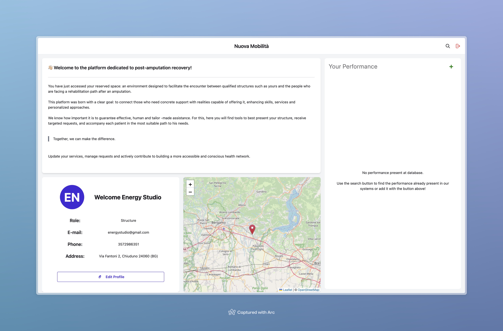

[](https://www.linkedin.com/in/giovanni-bombardieri-13ba7021b/)

<div align="center">
  
  <br />

Nuova Mobilità is a web platform dedicated to supporting people who are undergoing a post-amputation recovery journey. It connects users and qualified healthcare facilities, making it easier to find services, manage treatments, and facilitate communication between patients and specialized centers.

</div>
<br/>
<br/>

> 🚀 **Warning**  
> ⚠️ The app could use a few seconds to leave (free server).  
> 🪙 Budget coming - thanks for your patience!


## Main Features

- **Registration and Login** for users and healthcare facilities
- **Profile management** for individuals or facilities
- **Search for healthcare facilities** by name and location
- **View facility details** and contacts
- **Manage services** offered by facilities
- **Add and remove favorite facilities**
- **Facilities map** (for users)
- **Advanced service management** (for facilities)
- **Pagination system** for browsing facilities and services

<div align="center">
  
</div>

## Technologies used

### Frontend

- 
- 
- 

### Backend Laravel (PHP)

- 
- 

### Database

- 

### Containerization

- 

### Authentication

- Laravel Sanctum

### Geocoding

- OpenStreetMap Nominatim API

## Requirements

- Docker

If you want to use the app locally:

- Node.js (>=18)
- PHP (>=8.1)
- Composer
- MySQL

## Installation

### 1. Clone the repository

```bash
git clone https://github.com/GiovanniBombardieri/NuovaMobilita.git
cd nuova-mobilita
```

### 2. Configure the .env file

```bash
cp .env.example .env
```

### 3. Start with Docker

```bash
docker-compose up --build -d
```

### 4. Run migrations and seeders

```bash
cd backend
php artisan migrate
php artisan db:seed
php artisan key:generate
```

### 5. Try the application

```url
http://localhost:8000
```

## Usage

- Register and log in as a user or healthcare facility.
- Users can search for facilities, view details, add favorites, and browse available services.
- Facilities can manage their services and edit their profile.
- All operations are protected by authentication.

## Project structure

```
nuova-mobilita/
├── backend/    # Laravel API
├── frontend/   # React App
├── .env.example
└── docker-compose.yml
```

## Deployment & Hosting

- **Frontend**: the React application is deployed on [Netlify](https://nuova-mobilita.netlify.app/login).  
  API calls from the frontend point to the endpoint defined in the `VITE_API_URL` variable in the `.env.production` file in `frontend/`.

  > **Note:** For local development, make sure to change the `VITE_API_URL` variable in the `.env` or `.env.local` file to point to `http://localhost:8000` (or the port used by the backend).

- **Backend**: the Laravel API is containerized using Docker (see [`backend/Dockerfile`](backend/Dockerfile)) and deployed on [Render.com](https://render.com/).

  The deployment runs the script [`backend/start.sh`](backend/start.sh) which:

  - sets permissions and environment variables,
  - runs the migrations (`php artisan migrate --force`),
  - runs the seeders only if necessary,
  - starts PHP-FPM and Nginx.

- **Database**: the database (e.g., PostgreSQL or MySQL) is also hosted on Render.com and is accessible by the backend through environment variables.

### Local Development

- To test the frontend locally, make sure the `VITE_API_URL` variable points to the local backend.
- To start the backend locally, you can use Docker Compose by following the instructions already provided in the README.

## Contributing

1. Fork the project
2. Create a branch for your feature (`git checkout -b feature/FeatureName`)
3. Commit your changes
4. Push the branch
5. Open a Pull Request

## License

This project is licensed under the MIT License.

---

**For any questions or issues, open an issue on GitHub!**
